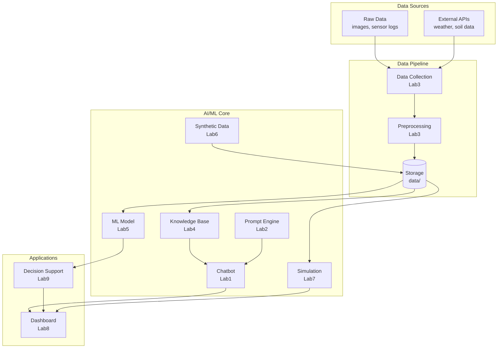
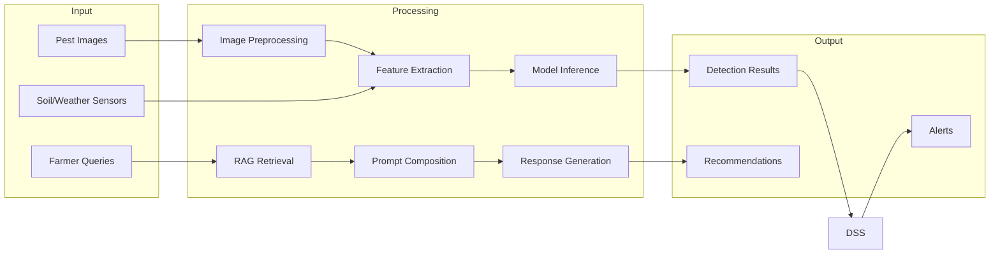

# System Architecture

## Overview
This pest detection system uses AI and machine learning to identify, analyze, and provide decision support for agricultural pest management. The system processes real-world data through multiple AI modules to deliver actionable insights to farmers.

## System Architecture



## Data Flow



## Component Details

### Lab 1: Chatbot (Domain Q&A)
- Purpose: Answer farmer questions about pest management
- Input: Natural language queries
- Output: Context-aware responses
- Dependencies: Lab2 (prompts), Lab4 (RAG knowledge base)
- Output path: `src/lab1_chatbot/`

### Lab 2: Prompt Engineering
- Purpose: Template management for LLM interactions
- Input: Prompt templates, context variables
- Output: Formatted prompts for various use cases
- Dependencies: None (foundational)
- Output path: `src/lab2_prompts/`

### Lab 3: Data Collection & Preprocessing
- Purpose: Gather and clean raw agricultural data
- Input: Images, sensor readings, external API data
- Output: Cleaned, normalized datasets
- Dependencies: None (foundational)
- Output path: `src/lab3_data/`
- Storage: `data/raw/`, `data/processed/`

### Lab 4: RAG System
- Purpose: Knowledge retrieval for context-aware responses
- Input: Vectorized documents, user queries
- Output: Relevant context passages
- Dependencies: Lab3 (processed data)
- Output path: `src/lab4_rag/`

### Lab 5: ML Predictive Model
- Purpose: Classify pests and predict infestations
- Input: Preprocessed features (images, sensor data)
- Output: Predictions, confidence scores
- Dependencies: Lab3 (processed data), Lab6 (synthetic data augmentation)
- Output path: `src/lab5_model/`
- Storage: `models/`

### Lab 6: GAN (Synthetic Data Generation)
- Purpose: Generate synthetic pest images and scenarios
- Input: Real training samples
- Output: Synthetic data samples
- Dependencies: Lab3 (real data)
- Output path: `src/lab6_gan/`
- Storage: `data/synthetic/`

### Lab 7: Scenario Simulation
- Purpose: Model pest spread and intervention outcomes
- Input: Environmental parameters, initial conditions
- Output: Simulation results, spread predictions
- Dependencies: Lab5 (model predictions)
- Output path: `src/lab7_simulation/`

### Lab 8: Dashboard
- Purpose: Visualization and user interface
- Input: All module outputs
- Output: Interactive charts, alerts, reports
- Dependencies: All labs
- Output path: `src/lab8_dashboard/`

### Lab 9: Decision Support System (DSS)
- Purpose: Integrate all insights for actionable recommendations
- Input: Predictions, simulations, RAG context
- Output: Ranked intervention strategies
- Dependencies: Labs 1-7
- Output path: `src/lab9_dss/`

## Directory Structure

```
AI application project/
├── src/
│   ├── lab1_chatbot/       # Domain Q&A chatbot
│   ├── lab2_prompts/       # Prompt engineering templates
│   ├── lab3_data/          # Data collection & preprocessing
│   ├── lab4_rag/           # Retrieval Augmented Generation
│   ├── lab5_model/         # Predictive ML model
│   ├── lab6_gan/           # Synthetic data generation
│   ├── lab7_simulation/    # Scenario simulation
│   ├── lab8_dashboard/     # Visualization dashboard
│   ├── lab9_dss/           # Decision support system
│   └── main.py             # Application entry point
├── data/
│   ├── raw/                # Original datasets
│   ├── processed/          # Preprocessed data
│   └── synthetic/          # AI-generated data
├── models/                 # Trained model files
├── docs/                   # Project documentation
├── tests/                  # Unit and integration tests
├── ARCHITECTURE.md
├── CLAUDE.md
└── STRUCTURE.json
```

## Technology Stack
- **Language**: Python 3.9+
- **ML Frameworks**: PyTorch/TensorFlow, scikit-learn
- **NLP**: Transformers (HuggingFace), sentence-transformers
- **Vector DB**: FAISS or ChromaDB
- **Frontend**: Streamlit or Flask (Dashboard)
- **Data**: Pandas, NumPy, OpenCV
- **Visualization**: Plotly, Matplotlib
