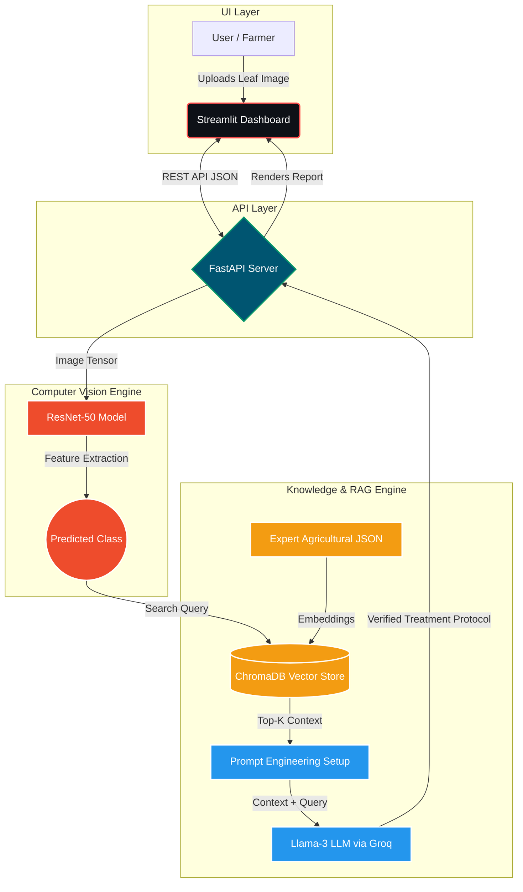

# 🌾 AgriVision-RAG: End-to-End Autonomous Crop Diagnosis System

[](https://www.python.org/downloads/)
[](https://fastapi.tiangolo.com/)
[](https://streamlit.io/)
[](https://pytorch.org/)
[](https://www.docker.com/)
[](https://opensource.org/licenses/MIT)

An industrial-grade, microservice-based AI system designed to solve the hallucination problem in agricultural AI. By integrating a **PyTorch Vision Model** with a **Retrieval-Augmented Generation (RAG)** pipeline, this system provides zero-hallucination, expert-verified treatment protocols for crop diseases.

---

## ✨ Key Features

- **Zero-Hallucination AI:** Traditional LLMs guess plant treatments. Our RAG pipeline retrieves strictly verified agricultural protocols from a local vector database before generating a response.
- **Deep Learning Vision Engine:** Powered by a fine-tuned ResNet-50 PyTorch model for high-accuracy disease classification.
- **Blazing Fast LLM:** Utilizes Llama-3 8B via the Groq LPU, ensuring near-instantaneous protocol generation.
- **Microservices Architecture:** Fully containerized setup featuring a FastAPI backend and a responsive Streamlit frontend.
- **Docker Ready:** Deploy the entire stack anywhere with a single `docker-compose` command.

---

## 📸 System Demo & Live Results

Our system seamlessly processes leaf images to provide accurate disease detection and verified treatment plans.

### Case Study 1: Tomato Septoria Leaf Spot
| 1. Image Upload | 2. AI Detection | 3. RAG Treatment Plan |
|:---:|:---:|:---:|
|  |  |  |

### Case Study 2: Corn Northern Leaf Blight
| 1. Image Upload | 2. AI Detection | 3. RAG Treatment Plan |
|:---:|:---:|:---:|
|  |  |  |

---

## 🧠 The Problem & Our Solution

Standard LLMs often "hallucinate" incorrect chemical dosages when asked about plant diseases, which can destroy crops. Traditional CNNs only classify the disease but leave the farmer without an actionable plan.

**AgriVision-RAG** bridges this gap:
1. **Perception:** A fine-tuned ResNet-50 model analyzes the leaf image.
2. **Retrieval:** The predicted disease class triggers a semantic search in a custom ChromaDB vector database containing verified agricultural protocols.
3. **Generation:** Llama-3 (via Groq LPU) synthesizes a context-aware, structured treatment report based *strictly* on the retrieved context.

---

## 🏗 System Architecture



---

## 🛠 Tech Stack

- **Deep Learning:** PyTorch, Torchvision (ResNet-50)
- **RAG & NLP:** Sentence-Transformers (all-MiniLM-L6-v2), ChromaDB, Groq API (Llama-3-8B)
- **Backend:** FastAPI, Uvicorn, Pydantic
- **Frontend:** Streamlit
- **DevOps:** Docker, Docker Compose

---

## 🚀 Getting Started

### Prerequisites
- Docker & Docker Desktop
- Groq API Key (Get one free at [Groq.com](https://groq.com/))

### Installation (Via Docker)
The easiest way to run the system in an isolated environment.

**1. Clone the repository:**
```bash
git clone https://github.com/YOUR_USERNAME/Vision-RAG-AgriSystem.git
cd Vision-RAG-AgriSystem
```

**2. Set up Environment Variables:**
Create a `.env` file in the root directory and add your API key:
```env
GROQ_API_KEY=your_groq_api_key_here
```

**3. Build and Run:**
```bash
docker build -t agri-vision-system .
docker run -p 8000:8000 -p 8501:8501 agri-vision-system
```

---

### Local Development (Without Docker)

**1. Create and activate virtual environment**
```bash
python -m venv agri_env
source agri_env/bin/activate  # On Windows: .\agri_env\Scripts\activate
```

**2. Install dependencies**
```bash
pip install -r requirements.txt
```

**3. Run the FastAPI Backend**
```bash
uvicorn api.main:app --reload --port 8000
```

**4. Run the Streamlit Frontend (In a new terminal)**
```bash
streamlit run app/frontend.py
```

---

## 📂 Project Structure

```text
├── api/                  # FastAPI application & routes
├── app/                  # Streamlit frontend UI
├── assets/               # Demo images and icons
├── data/                 # Raw, processed, and synthetic datasets
├── docs/                 # System diagrams and presentations
├── models/               # PyTorch model weights (.pth)
├── notebooks/            # Jupyter notebooks for training (Colab)
├── src/                  # Core modules
│   ├── lab1_chatbot/     # Groq LLM Chatbot
│   ├── lab2_prompts/     # Centralized prompt templates
│   ├── lab3_data/        # Data collection & preprocessing
│   ├── lab4_rag/         # ChromaDB & Document Retrieval
│   ├── lab5_model/       # ResNet-50 Inference
│   ├── lab6_gan/         # DCGAN Synthetic Generation
│   ├── lab7_simulation/  # SIR Spread Simulation
│   ├── lab8_dashboard/   # Dashboard Utilities
│   ├── lab9_dss/         # Decision Support & Scoring
│   └── main.py           # Application entry point
├── vector_db/            # ChromaDB local persistence
├── Dockerfile            # Container configuration
├── requirements.txt      # Python dependencies
└── README.md
```

---

## 📄 License

This project is licensed under the MIT License - see the [LICENSE](LICENSE) file for details.

---

## 🤝 Contributing

Contributions, issues, and feature requests are welcome! Feel free to check the [issues page](https://github.com/YOUR_USERNAME/Vision-RAG-AgriSystem/issues) if you want to contribute.
