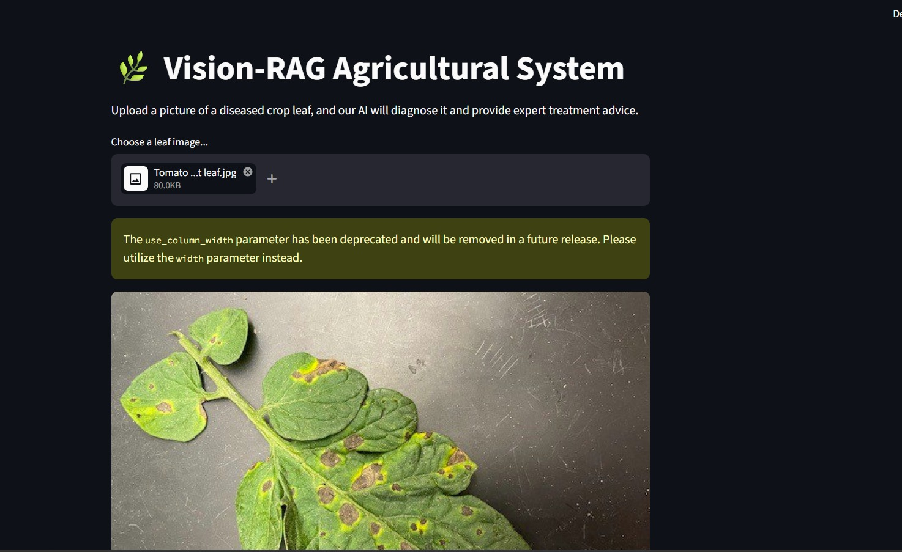
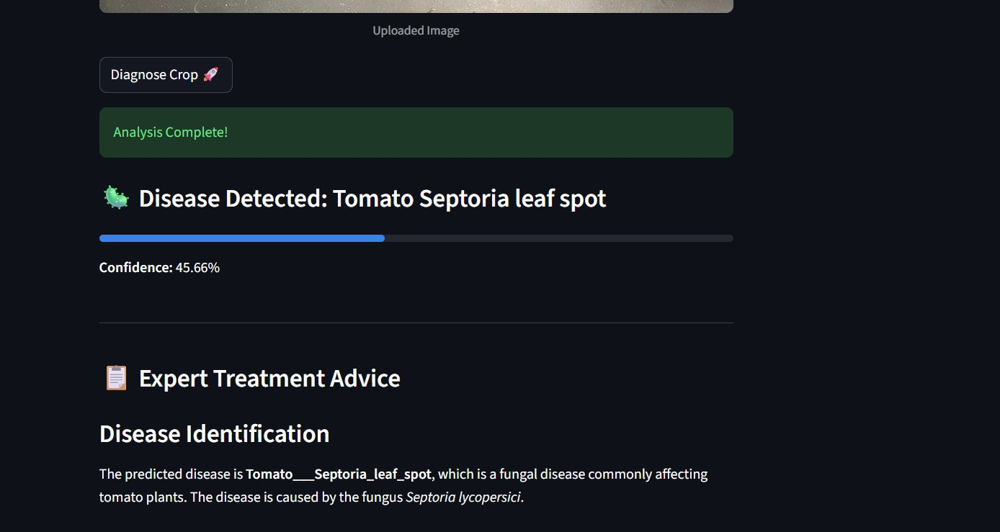
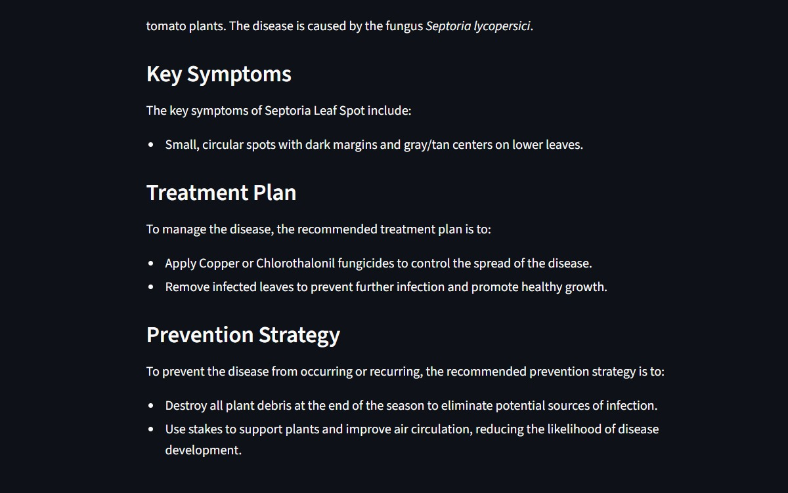
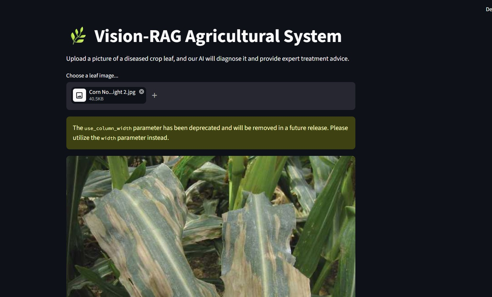
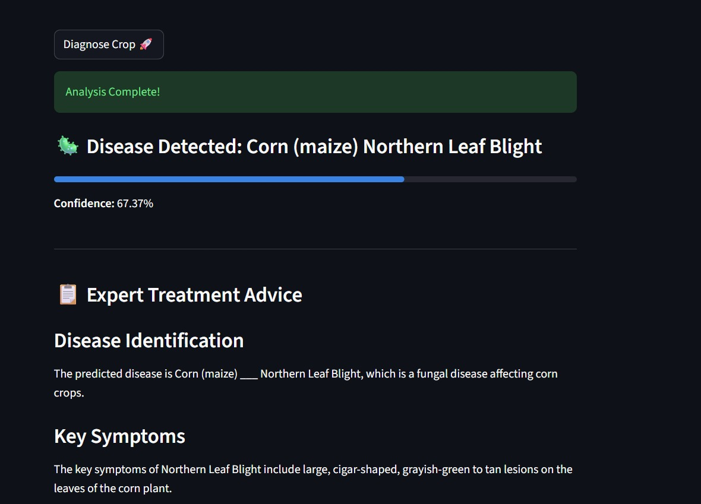
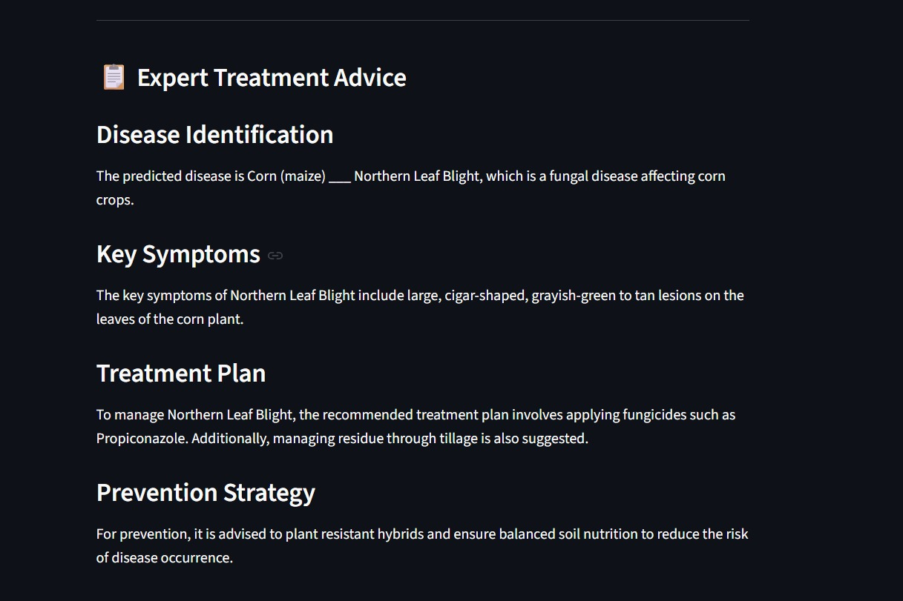
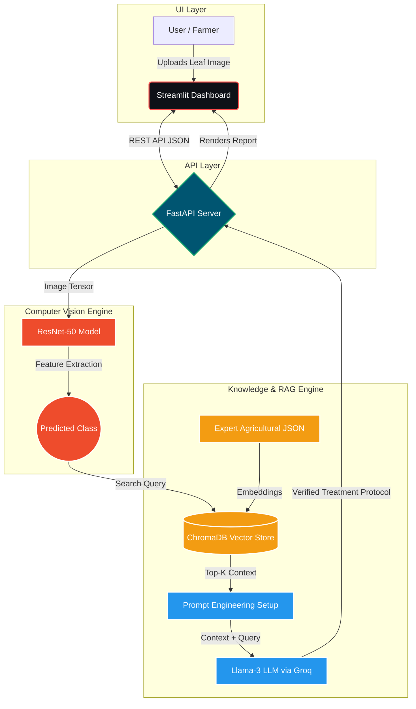

#  AgriVision-RAG: End-to-End Autonomous Crop Diagnosis System

An industrial-grade, microservice-based AI system designed to solve the hallucination problem in agricultural AI. By integrating a **PyTorch Vision Model** with a **Retrieval-Augmented Generation (RAG)** pipeline, this system provides zero-hallucination, expert-verified treatment protocols for crop diseases.

---

##  System Demo & Live Results

Our system seamlessly processes leaf images to provide accurate disease detection and verified treatment plans. Below are real inferences from the system:

**Case Study 1: Tomato Septoria Leaf Spot**
<table>
  <tr>
    <td align="center"><b>1. Image Upload</b></td>
    <td align="center"><b>2. AI Detection</b></td>
    <td align="center"><b>3. RAG Treatment Plan</b></td>
  </tr>
  <tr>
    <td></td>
    <td></td>
    <td></td>
  </tr>
</table>

**Case Study 2: Corn Northern Leaf Blight**
<table>
  <tr>
    <td align="center"><b>1. Image Upload</b></td>
    <td align="center"><b>2. AI Detection</b></td>
    <td align="center"><b>3. RAG Treatment Plan</b></td>
  </tr>
  <tr>
    <td></td>
    <td></td>
    <td></td>
  </tr>
</table>

---

##  The Problem & Our Solution
Standard LLMs often "hallucinate" incorrect chemical dosages when asked about plant diseases, which can destroy crops. Traditional CNNs only classify the disease but leave the farmer without an actionable plan.

**AgriVision-RAG** bridges this gap:
1. **Perception:** A fine-tuned ResNet-50 model analyzes the leaf image.
2. **Retrieval:** The predicted disease class triggers a semantic search in a custom ChromaDB vector database containing verified agricultural protocols.
3. **Generation:** Llama-3 (via Groq LPU) synthesizes a context-aware, structured treatment report based *strictly* on the retrieved context.

---

##  System Architecture

